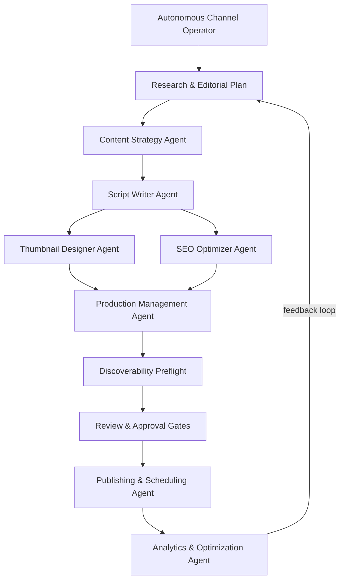
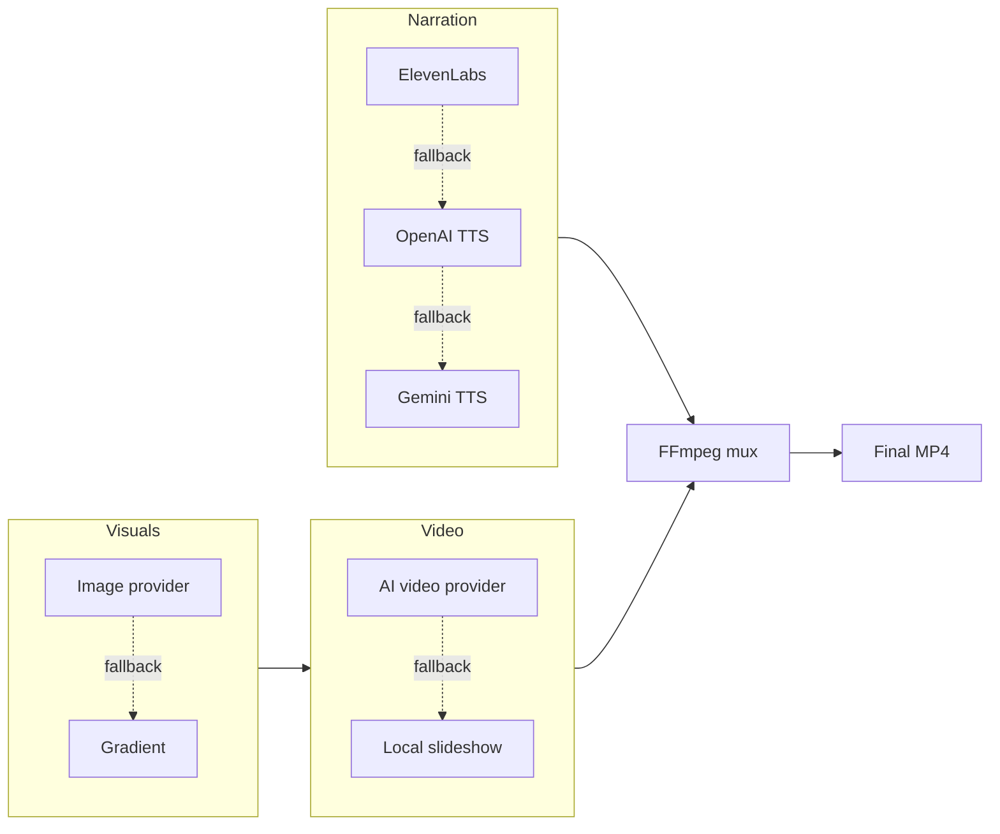

# YT Agent - Autonomous YouTube Automation

**A self-hosted AI agent that runs a YouTube channel end to end.**

Research topics → write scripts → generate narration and visuals → assemble real videos → optimize metadata → review → schedule → publish → learn from analytics and audience comments. You keep human approval and full control of your credentials, media, and data.

[](LICENSE)
[](package.json)
[](#quick-start)
[](https://expressjs.com/)

---

## About

YT Agent is an autonomous, approval-first content system for YouTube creators and operators. You describe the channel you want - objective, audience, content pillars, cadence, and guardrails - and the agent turns that into researched content plans and full productions: script, narration, visuals, thumbnail, SEO metadata, and a real assembled MP4. Nothing reaches your channel until it passes quality, rights, and human-review gates.

It runs entirely on your own machine. Your API keys, generated media, and channel data never leave your control, and every side-effecting action (publishing, posting a comment, spending paid credits) requires explicit confirmation. Simulated or placeholder output can never enter the approval or publishing path.

**Who it's for:** creators running faceless or automated channels, teams that want a repeatable content pipeline with an audit trail, and developers who want a hackable, provider-agnostic foundation for AI video production.

## Features

- **End-to-end pipeline** - seven cooperating agents take a topic from research to a published, analyzed video.
- **Approval-first by design** - quality checks, factual-review and media-rights attestations, and provenance gates block scheduling until you approve.
- **Provider-flexible AI** - use OpenAI, Gemini, OpenRouter, Kimi, MiMo, GLM, or any OpenAI-compatible text endpoint; ByteDance Seedance, MiniMax, Google, Kling, Wan, or local FFmpeg for video.
- **Real MP4 output** - narration is timed to the audio and assembled with FFmpeg; the agent distinguishes real video from simulated placeholders and refuses to publish placeholders.
- **Autonomous Channel Operator** - give it an objective and it researches, plans, and produces on a cadence, with every decision persisted and visible.
- **Resumable and crash-safe** - every generation stage checkpoints to SQLite; interrupted jobs resume from the first incomplete stage, and route errors never take down the server.
- **Scene-level control** - a durable scene manifest lets you edit, reorder, lock, replace, or regenerate a single scene without rebuilding the whole video.
- **Shorts repurposing** - turn an approved long-form video into vertical 9:16 Shorts with burned captions, reusing existing media.
- **Honest analytics and learning** - performance evidence comes from YouTube; missing metrics are reported as unavailable, never invented, and no learning influences planning until you approve it.
- **Secure by default** - mutating API routes require a key, the server binds to loopback, and OAuth tokens and credentials stay in gitignored local files.

## Quick start

Fork the repo (top-right **Fork** button, or [this direct link](https://github.com/Hamza-Maqsood1/youtube-automation-agent/fork)), then clone your fork and run it:

```bash
# clone this repository (or your fork)
git clone https://github.com/Hamza-Maqsood1/youtube-automation-agent.git
cd youtube-automation-agent

npm install
npm run walkthrough
npm start
```

Open `http://localhost:3456`. The guided walkthrough explains each provider choice, tests your credentials, and walks you through YouTube authorization. Prefer a shorter path? `npm run setup` runs a classic flow, and `.env.example` documents every setting.

### What you need

- **Node.js 18+**
- A **Google account** and **YouTube Data API** OAuth credentials (free)
- **At least one AI text provider key** (Gemini has a free tier)
- **FFmpeg** - installed automatically via `ffmpeg-static`
- *(Optional)* Python 3.9+ and DarkzSEO for the discoverability preflight

## How it works

Each agent owns one stage of the pipeline, and analytics feed back into planning:



| Agent | Role |
|-------|------|
| **Content Strategy** | Analyzes YouTube trends and competitors, identifies topics, plans the calendar |
| **Script Writer** | Generates scripts with hooks, storytelling, and CTAs |
| **Thumbnail Designer** | Creates thumbnails and A/B variants |
| **SEO Optimizer** | Titles, descriptions, tags, chapters |
| **Production** | Coordinates TTS narration, visuals, and FFmpeg video assembly |
| **Discoverability** | Optional advisory GEO/AIO/AEO content audits via DarkzSEO |
| **Publishing** | Uploads, schedules, and manages the queue |
| **Analytics** | Tracks performance and feeds evidence-backed learnings to strategy |

### From idea to published video

| Stage | What YT Agent does | What you control |
| --- | --- | --- |
| Research | Finds topics and builds a content strategy | Niche, audience, blocked topics |
| Script | Writes the hook, narrative, CTA, and metadata | Voice, format, length, brand direction |
| Production | Generates narration and visuals, then assembles a real MP4 | Provider choice and media fallbacks |
| Review | Runs quality checks and opens the video in Review Studio | Facts, media rights, edits, approval |
| Publish | Schedules and uploads approved content | Privacy, timing, final decision |
| Learn | Captures 24-hour and 7-day evidence, measures outcome and economics, proposes the next move | The KPI, and approval of each learning |

## AI providers

All OpenAI-compatible providers work out of the box - the SDK base URL is auto-configured. Pick one, or use OpenRouter to reach everything with a single key.

| Provider | Models | Base URL |
|----------|--------|----------|
| **OpenAI** | GPT-5.6 Sol, Terra, Luna | `api.openai.com/v1` |
| **OpenRouter** | 400+ models, validated against the live catalog | `openrouter.ai/api/v1` |
| **Google Gemini** | Gemini 3.7 Flash, 3.1 Pro, 3.5 Flash-Lite | `@google/genai` SDK |
| **Kimi (Moonshot AI)** | Kimi K3, K2.7 Code, K2.6 | `api.moonshot.ai/v1` |
| **MiMo (Xiaomi)** | MiMo V2.5 Pro, V2.5 | `api.xiaomimimo.com/v1` |
| **GLM (Zhipu AI)** | GLM-5.3, 5.2, 5.1 | `api.z.ai/api/paas/v4/` |

Additional integrations: ElevenLabs (premium TTS), Replicate, and any OpenAI-compatible endpoint.

**Text-generation resilience:** the agent selects one text provider at startup. Transient failures (rate limits, timeouts, empty responses) are retried with exponential backoff; if the provider stays down, the job fails and can be resumed later rather than silently producing template filler.

### AI video providers

Local slideshow rendering is the default, so nothing starts paid video requests until you opt in. Choose a provider in **Channel setup**, set a paid-seconds cap, then run the opt-in paid-video readiness probe.

| Provider | Default model | Best fit | Clip limits |
| --- | --- | --- | --- |
| **Local slideshow** | FFmpeg + Playwright | No-cost default; narration-timed slides | any length |
| **ByteDance** | `bytedance/seedance-2.5` (Replicate) | Cinematic scenes, large reference sets | 4-30s |
| **MiniMax** | `MiniMax-H3` | Multimodal references, native stereo audio | 4-15s |
| **Google** | `gemini-omni-flash-preview` | Fast generation, conversational editing | 3-10s |
| **Kuaishou** | `kling-v3-omni` | Storyboards, character/voice consistency | 3-15s |
| **Alibaba** | Wan 2.7 models | Efficient generation, reference video | 2-15s |

Long-form productions use hybrid assembly: bounded provider clips for the hook and key sections, the rest filled locally, narration mixed in, and generated captions kept alongside. Provider task IDs are persisted before polling, so an interrupted job resumes the known task instead of re-submitting it.

## Studios & workflows

### Verify production readiness
Before autonomous production, run the **Production readiness** check. It makes small live text and narration requests, verifies YouTube channel access, creates and decodes a temporary MP4 containing audio and video, and validates every queued upload's metadata. It never creates or uploads a real YouTube video, and probe assets are deleted afterward. Paid image and video probes are separate opt-in checkboxes. A recorded blocking failure stops autonomous generation and publishing until a later run passes.

### Resume an interrupted production
Every generation stage writes a SQLite checkpoint. The dashboard shows the saved-stage count and the first incomplete stage. Choose **Resume** to continue, or select an earlier stage to intentionally regenerate it and everything after. Saved files are validated before reuse; missing artifacts are regenerated. Autonomous runs preserve their research and editorial plan and continue only the unfinished items. Publishing is fail-closed: if an upload may have reached YouTube without returning a video ID, the agent requires channel reconciliation before trying again.

### Repair one scene without starting over
Every production keeps a durable scene manifest - narration, visual prompt, timing, provider/task identity, asset origin, rights state, evidence links, and revision history. **Scene Repair Studio** lets you edit a scene, change its order, lock a scene that already works, upload a licensed replacement, or regenerate only that scene. Scene timing follows the measured narration, so captions and description chapters stay aligned with the real audio. Paid regeneration always shows the provider and generated seconds and requires confirmation; uploaded assets require a rights confirmation. When the timeline is ready, **Rebuild final video** creates a new MP4 and scene-aware captions while preserving the previous version.

### Narration is fail-closed
The agent records the TTS provider, model, external task, generation time, cost evidence, and failure reason for every scene. If narration is missing, simulated, stale, or failed, the production cannot be approved, scheduled, or published. An intentionally silent production requires a separate confirmation and a stored reason - silence is never inferred from a failed provider call.

### Repurpose an approved video into Shorts
**Shorts Repurposing Studio** selects self-contained windows from the scene timeline and preserves the exact source-scene IDs, timing, rationale, metadata, layout, and inherited review evidence. Choose a blurred-canvas, center-crop, or stacked-focus layout and render a real 9:16 MP4 with mobile-safe burned captions. Source video and narration are reused, so the default workflow spends no new credits. Every Short has its own approval and schedule.

### Review research and provenance
Each production has an **Evidence desk**. Autonomous research carries exact YouTube source metadata into the production, and AI scripts list the factual claims that need review. A claim can be approved only when it links to a verified source; unsupported claims stay blocking unless intentionally waived with a note. Use the altered/synthetic-media control when a video needs YouTube disclosure - the value flows into the upload request.

### Discoverability preflight (optional)
Each saved production can receive an advisory **DarkzSEO Discoverability Preflight**. The adapter sends a canonical content package to DarkzSEO's JSON API and stores the engine and schema versions, severity summary, stable rule IDs, and findings in SQLite. Findings are advisory - keep a useful one actionable or dismiss a false positive with a reason that carries forward. Missing Python, an unavailable install, timeouts, and schema mismatches are explicit and never block publication.

Install DarkzSEO 1.4+ into Python or point `DARKZSEO_PATH` at `darkzseo.py`. The adapter uses a shell-free child process over JSON stdin/stdout.

### Run the Autonomous Channel Operator
Describe the channel **outcome**, not a task list: objective, audience, pillars, cadence, success metric, and boundaries. The operator refreshes YouTube trend and competitor signals, checks recent topics, builds an evidence-labeled editorial plan, and sends each planned video through the full pipeline. Finished videos still wait for factual review, media-rights confirmation, and approval - autonomy never bypasses the gates, and simulated videos cannot publish.

### Close the performance loop
After publication, the agent captures 24-hour and 7-day snapshots and evaluates retention, engagement, watch time, format, length, hook style, and title style against the channel's own history - not a universal view target. Open **Analytics → What the agent learned** to review the evidence and confidence behind each recommendation. Pending or rejected recommendations never influence generation; once you approve one, the next operator run applies it as an explicit constraint. Simulated fallbacks are stored as unverified and never feed baselines or recommendations.

### Outcome & ROI
A strategy can define a measurable primary outcome - views, watch hours, net subscribers, engagement rate, or estimated revenue - plus a target, evidence window, monthly budget, and currency. **Analytics → Outcome & ROI Studio** shows target progress, net subscribers, estimated revenue, known cost, ROI, and comparisons by pillar, format, and provider. Missing evidence is explicit: a channel without monetization access shows revenue as unavailable rather than zero.

### Scene-aware retention
At each analytics window the agent maps YouTube's audience-retention curve onto the stored scene durations. **Analytics → Scene-aware retention** shows the curve divided by scene with drop-off, rewatch, strong-hold, and steady signals. Missing, sparse, or simulated curves never enter this layer, and findings only guide future scripts after you approve them.

### Engage with your audience
**Engagement** syncs comments for recent videos, classifies them into themes, sentiment, and questions, and quarantines likely spam, scams, and toxic comments into a needs-attention list - it never deletes or hides a comment. **Draft replies** suggests answers in your channel's voice; nothing posts without explicit approval, and posting requires the `youtube.force-ssl` permission. A daily reply cap keeps sessions bounded. When several commenters ask for the same thing, the agent mines an audience-requested idea (with comment permalinks) that stays pending until you approve it.

> **Note on packaging experiments:** thumbnail impressions and click-through rate are not exposed by the YouTube Analytics API - they live only in the Reporting API's bulk `channel_reach_basic_a1` report, which YT Agent does not yet ingest. Until then, CTR-based learning and Controlled Growth Experiments report the metric as unavailable; use YouTube Studio's **Test & Compare** for packaging tests.

## Configuration

### YouTube Data API (required, free)

1. Create a project in [Google Cloud Console](https://console.cloud.google.com/)
2. Enable **YouTube Data API v3**
3. Create an **OAuth 2.0 client** (Desktop app)
4. Save the JSON as `config/credentials.json`

### AI provider keys

| Provider | Get a key | Env var |
|----------|-----------|---------|
| OpenAI | [platform.openai.com](https://platform.openai.com/) | `OPENAI_API_KEY` |
| OpenRouter *(one key, all models)* | [openrouter.ai/keys](https://openrouter.ai/keys) | `OPENROUTER_API_KEY` |
| Google Gemini *(free tier)* | [Google AI Studio](https://aistudio.google.com/) | `GEMINI_API_KEY` |
| Kimi (Moonshot AI) | [platform.kimi.ai](https://platform.kimi.ai) | `MOONSHOT_API_KEY` |
| MiMo (Xiaomi) | [mimo.mi.com](https://mimo.mi.com) | `MIMO_API_KEY` |
| GLM (Zhipu AI) | [z.ai](https://z.ai) | `GLM_API_KEY` |

### Environment variables

```env
# AI provider - pick one (or use OpenRouter for access to all)
OPENAI_API_KEY=sk-...
# OPENROUTER_API_KEY=sk-or-...
# GEMINI_API_KEY=...

# Optional: premium TTS
# ELEVENLABS_API_KEY=...
# ELEVENLABS_VOICE_ID=...

# Optional: AI video generation
# VIDEO_PROVIDER=slideshow # auto, seedance, minimax_h3, google_omni, kling, wan
# VIDEO_MAX_GENERATED_SECONDS=60
# REPLICATE_API_TOKEN=... # Seedance
# MINIMAX_API_KEY=... # MiniMax H3
# DASHSCOPE_API_KEY=... # Wan

# App config
NODE_ENV=production
PORT=3456
CHANNEL_NAME=Your Channel Name
DEFAULT_PRIVACY_STATUS=private
# CHANNEL_TIMEZONE=America/Chicago # timezone for scheduled jobs

# Security - every POST/PUT/PATCH/DELETE route requires x-api-key.
# Leave empty to auto-generate a key in data/.api-key; a dashboard opened on
# this machine fetches it automatically. The server binds to 127.0.0.1.
# API_KEY=some-long-random-string
# HOST=127.0.0.1
# ALLOWED_HOSTS=

# Optional tuning (defaults shown)
MAX_CONCURRENT_JOBS=1
AI_TEXT_MAX_ATTEMPTS=4
AI_TEXT_TIMEOUT_MS=120000
```

Setup, first-real-MP4, approval, publication, and repeat-generation milestones are calculated locally from SQLite and files on disk. A video counts only when a non-simulated `.mp4` with a valid container signature exists. This data stays local.

## Automation schedule

```mermaid
gantt
 title Daily Pipeline
 dateFormat HH:mm
 axisFormat %H:%M
 section Content
 Generate content (strategy + script + thumbnail + SEO) :06:00, 2h
 section Publishing
 Process publishing queue :crit, 08:00, 14h
 section Analytics
 Collect analytics :09:00, 1h
 Run optimizations :22:00, 1h
```



The scheduler starts with `npm start` and runs in your channel timezone: content generation at 06:00, publishing queue every 15 minutes, analytics at 09:00, optimization at 22:00, and a weekly strategy review on Sundays. A job never overlaps its own previous run. With an active strategy, the morning check uses its cadence and launches an autonomous run when the buffer needs work.

## API

```bash
# health check (no key needed)
curl http://localhost:3456/health

# mutating routes need x-api-key: API_KEY from .env, or the generated key in data/.api-key
API_KEY=${API_KEY:-$(cat data/.api-key)}

# queue a video-generation job
curl -X POST http://localhost:3456/generate \
 -H "Content-Type: application/json" -H "x-api-key: $API_KEY" \
 -d '{"topic": "Top 10 Life Hacks", "style": "list"}'

# inspect a background job, then resume it from its first incomplete stage
curl http://localhost:3456/api/jobs/:jobId
curl -X POST http://localhost:3456/api/jobs/:jobId/resume \
 -H "Content-Type: application/json" -H "x-api-key: $API_KEY" -d '{}'

# save and activate a channel strategy
curl -X PUT http://localhost:3456/api/operator/strategy \
 -H "Content-Type: application/json" -H "x-api-key: $API_KEY" \
 -d '{"objective":"Own practical AI automation for small teams","audience":"Small business operators","contentPillars":["AI workflows","Automation playbooks"],"cadencePerWeek":2,"defaultFormat":"tutorial","primaryKpi":"subscribers","status":"draft"}'
curl -X POST http://localhost:3456/api/operator/start \
 -H "Content-Type: application/json" -H "x-api-key: $API_KEY" -d '{}'

# review and approve content before scheduling
curl http://localhost:3456/api/content/:contentId
curl -X POST http://localhost:3456/api/content/:contentId/approve \
 -H "Content-Type: application/json" -H "x-api-key: $API_KEY" \
 -d '{"privacyStatus":"private","factChecked":true,"rightsConfirmed":true}'
```

Other endpoints: `GET /api/readiness`, `GET /schedule`, `GET /analytics`, `GET /api/outcomes`, `GET /api/experiments`, `GET /api/retention/:videoId`, and the learning, engagement, scene-repair, and shorts routes. All mutating routes require the `x-api-key` header.

## Production pipeline



Each stage has graceful fallbacks, but output that could not be produced for real is marked simulated and cannot be approved or published.

## Project structure

```
yt-agent/
├── agents/ # one file per pipeline agent
├── config/ # credentials and example configs (real keys are gitignored)
├── database/ # SQLite schema and access layer
├── data/ # generated content and assets (gitignored)
├── schedules/ # cron-based automation
├── utils/ # AI services, autonomous operator, media, logging, security
├── dashboard/ # web UI
└── index.js # Express server + agent initialization
```

## Troubleshooting

| Problem | Fix |
|---------|-----|
| `Missing credentials for: an AI provider` | Configure any one provider with `npm run credentials:setup` |
| `'ffmpeg' is not recognized` / no .mp4 | Run `npm install` (fetches the bundled binary) or set `FFMPEG_PATH` |
| Video marked `simulated`, nothing uploads | Check the ✗ lines in the startup capability check - a key or FFmpeg is missing |
| Nothing publishes from the queue | Content publishes at its scheduled time; the queue log shows what's waiting |
| YouTube API quota exceeded | Check quotas in Google Cloud Console; reduce posting frequency |
| Generation failed | Verify keys and credits; check `logs/`, then **Resume** the job |
| `401 Unauthorized` on the API | Send the `x-api-key` header (`API_KEY` from `.env` or `data/.api-key`) |

Enable debug logging:

```bash
NODE_ENV=development npm start
```

## Contributing

This is a self-hosted project. See [CONTRIBUTING.md](CONTRIBUTING.md) for development notes, the test workflow, and known gaps.

## Author

**Hamza Maqsood**
[GitHub](https://github.com/Hamza-Maqsood1) · [LinkedIn](https://www.linkedin.com/in/hamza-maqsood1)

## License

MIT - see [LICENSE](LICENSE).

## Acknowledgments

Built with OpenAI, Google Gemini, OpenRouter, Moonshot AI, Xiaomi MiMo, Zhipu AI, ElevenLabs, Replicate, the YouTube Data API, FFmpeg, Express, and Playwright.

---

> For legitimate content creation only. Comply with [YouTube's Terms of Service](https://www.youtube.com/t/terms) and Community Guidelines.
